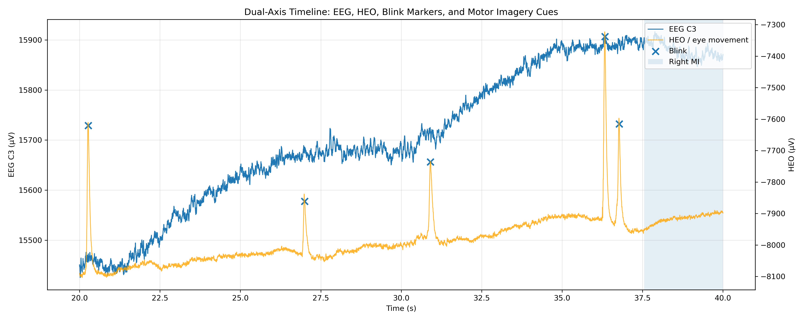
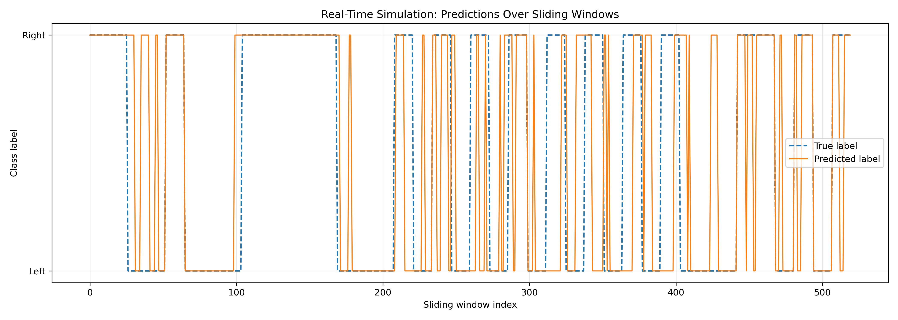
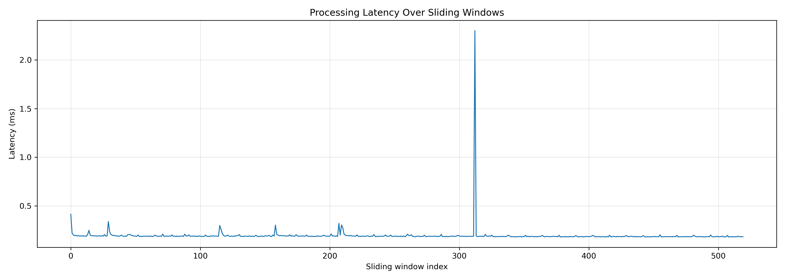

# Real-Time Multimodal Motor Imagery BCI (EEG + EOG) (Python)

This project implements a multimodal Brain-Computer Interface (BCI) pipeline for motor imagery (MI) decoding using **EEG (neural signals)** and **EOG / HEO (eye movement signals)** and **Blink-related physiological activity**

The project combines:
- CSP-based EEG decoding
- EOG feature extraction
- Artifact-aware analysis
- Real-time sliding-window simulation

to investigate how neural and non-neural physiological signals jointly influence BCI performance.

## Dataset Background

This work is based on the following dataset:

[Guttmann-Flury, E., Sheng, X. & Zhu, X. Dataset combining EEG, eye-tracking, and high-speed video for ocular activity analysis across BCI paradigms. Sci Data 12, 587 (2025).](https://arxiv.org/pdf/2506.07488)

The dataset is available online [here](https://www.synapse.org/Synapse:syn64005218/wiki/630018)

## Objectives
- Decode left vs right motor imagery
- Build a simulated real-time BCI pipeline
- Analyse the impact of blink and eye-movement artifacts
- Integrate EEG and EOG features into a multimodal classifier
- Evaluate latency and prediction stability

## Why Multimodal?

EEG signals are noisy and highly affected by physiological artifacts. Instead of treating eye movements as pure noise, this project models them explicitly using EOG features and incorporates them into the classification pipeline.

This allows the system to:
- analyse relationships between neural and ocular activity
- investigate how physiological artifacts influence decoding
- explore multimodal feature representations

## Design Choices

- **Decoded Channels**: Based on the original paper, the following electrodes are excluded from analysis, as they were identified as either malfunctioning or exhibiting bridging effects: PO3, F1, POZ, OZ, F3, O2, P8, PO7, FC3, P7, and P4
- **Sliding Window**: In the real-time stage, a sliding window with a window size of 1.0 s and a step size of 0.25 s is chosen  

## Load EEG motor imagery data

- Download the dataset from [here](https://www.synapse.org/Synapse:syn64005218/wiki/630018)

- Start by loading motor imagery-based EEG recording of one of the subjects. `S01/Sess01/Neuroscan/MI011.csv ` is chosen here.

## Offline Pipeline Overview
In this stage, trial-level offline evaluation is performed. One feature vector is extracted per MI trial.

Run: ` run_offline_pipeline.py `

### Preprocessing
- Band-pass filtering (mu/beta band)
- Event extraction from motor imagery cues
- Epoch segmentation

### Feature Extraction

- EEG Features (CSP): 
Common Spatial Patterns (CSP) is used to extract discriminative spatial features from multichannel EEG recordings. CSP learns spatial filters that maximise variance differences between motor imagery classes, improving class separability.

- EOG Features (HEO):

Extracted per epoch:

- Signal variance
- Mean absolute amplitude
- Peak amplitude

These features capture eye-movement-related activity and blink intensity.

### Multimodal Feature Fusion

The final feature vector is constructed as the concatenation of EEG CSP features and EOG features which produce a joint multimodal representation of neural and physiological signals.

### Artefact Impact

| Dataset        | Accuracy |
|---------------|--------|
| All epochs    | 83.3% |
| Clean epochs  | 75.0% |

Removing noisy epochs reduced performance. So we can infer that the model is using EOG information. Eye movements contain task-correlated signals and artifacts are not purely noise and they can be informative

### EEG + EOG Timeline
- Dual-axis plot showing:
  - EEG (C3)
  - Eye movement (HEO)
  - Blink markers
  - Motor imagery cues
 

### Interpreting Multimodal Performance

The multimodal model achieved higher performance when noisy epochs were included.

This indicates that the classifier may leverage:
- eye movements
- blink-related activity
- auxiliary physiological signals

in addition to neural motor imagery patterns.

This project therefore demonstrates both:
- the power of multimodal physiological analysis
- the risk of unintended non-neural information leakage in BCI systems

## Real-Time Pipeline Overview

In this stage, window-level real-time simulation is performed. Each trial is divided into overlapping 1-second windows.

Run: ` run_realtime_simulation.py `

### Real-Time Simulation

The real-time simulation achieved:

- Offline CSP accuracy: **73.7%**
- Real-time sliding-window accuracy: **75.4%**
- Mean latency: **0.334 ms**

The similarity between offline and simulated real-time performance suggests that the CSP-based pipeline generalises well to streaming EEG scenarios.

### Real-Time Predictions
- Sliding-window predictions vs ground truth
 

## Latency Analysis

The processing latency remained below a few milliseconds across sliding windows. This demonstrates that the decoding pipeline is lightweight enough for near real-time inference, which is important for interactive BCI systems where responsiveness directly affects usability and user experience.
 

